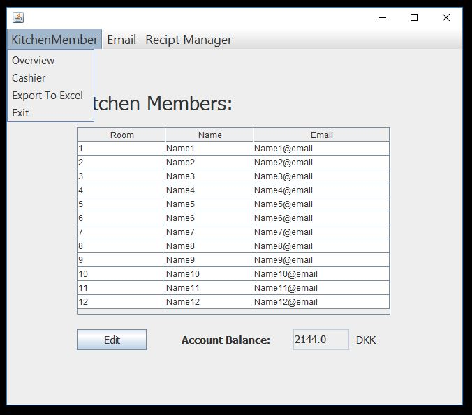
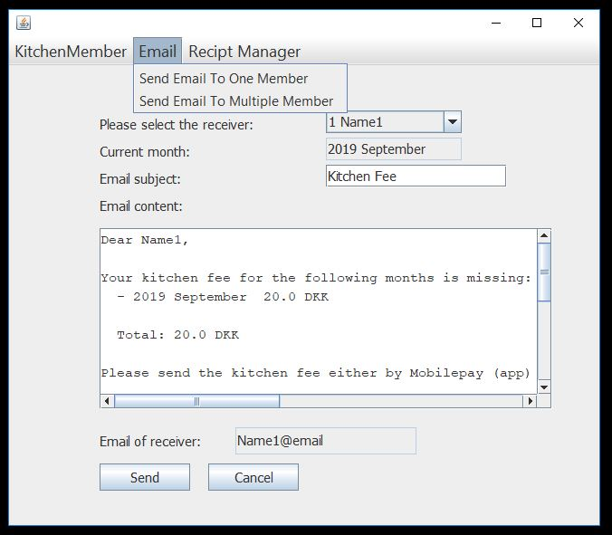
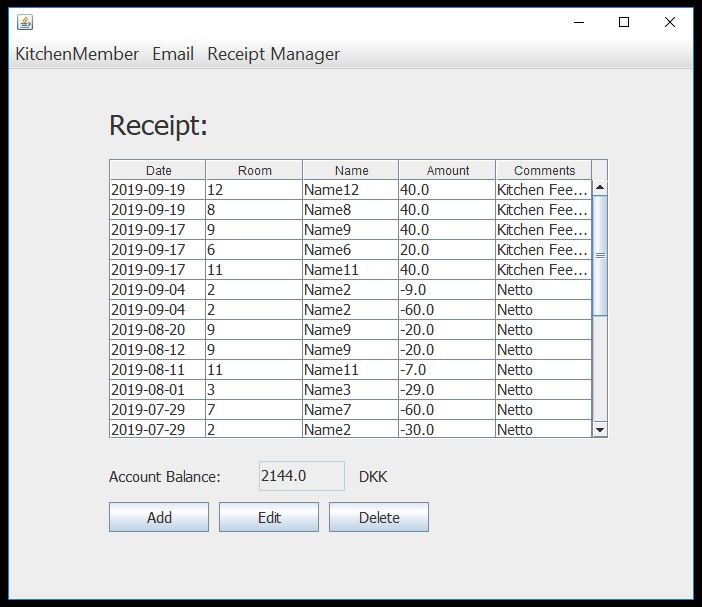

# Kitchen Manager
The Kitchen Manager is a Java GUI application for kitchen account management. The features includes the management of member information, receipt and kitchen monthly fee, and sending reminder email of monthly kitchen fee. 

## Prerequisites

* Java SE Development Kit 8
* MySQL 

## Installing

1. Fork the repository at https://github.com/TiWa007/kitchenManager.git. Clone the fork to your hard disk.
1. Import the project into Eclipse.
    - Go to `File → Import...` and under `General`, select `Existing Projects into Workspace`.
1. Add External Archives
    - [javax.mail](http://www.java2s.com/Code/Jar/j/Downloadjavaxmailjar.htm)
    - [Apache POI](https://poi.apache.org/download.html#POI-4.1.0)
	- [MySQL Connector Java](https://jar-download.com/artifacts/mysql/mysql-connector-java)
	- [JCalendar](http://www.java2s.com/Code/Jar/j/Downloadjcalendar14jar.htm)
1. Set up MySQL connection in Java
	- Open the file `src/DAO/DBConnection.java`, and change the values of `USERNAME` and `PASSWORD` to the username and password of your localhost. In addition, create a database named `test_km` in your localhost.
1. Run the GUI application in the file `src/GUI/KitchenManagerGUI.java`

## Built With

* [WinderBuilder](https://www.eclipse.org/windowbuilder/) - Java GUI designer
* [MySQL](https://www.mysql.com/) - Database management

## License

This project is licensed under the [MIT License](LICENSE).
